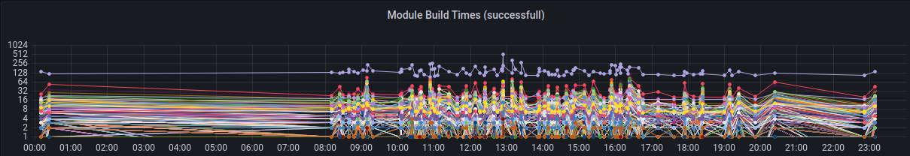
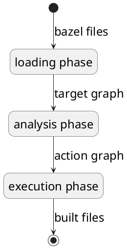
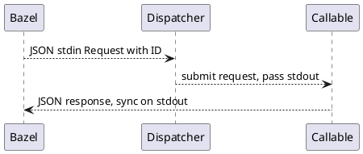
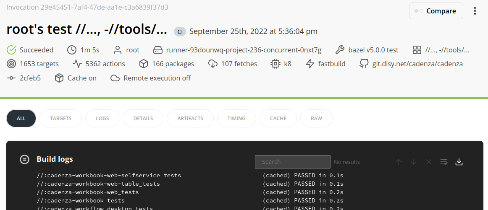
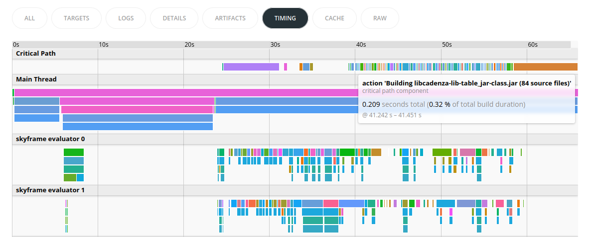
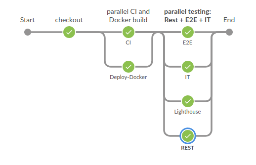

# Slides

github.com/c-goetz/jug

# Allgemeines

- meine eigene Meinung, nicht die meines Arbeitgebers
- ich liebe Maven, es ist ein großartiges Stück Software
- Denglish Galore
- Talk kann Spuren von dreifach verschachtelten Build Systemen enthalten
- Setzt Maven Wissen voraus

::: notes

- Neige zu überspitzten Formulierungen
- unser Build wird einfach zu groß für Maven

:::

# Ausgangssituation

- Cadenza:
- über 25 Jahre Entwicklung
- 572 Maven Module
- über 2 Mio. LOC Java/JS/TS/CSS
- 90 Kloc pom
- über 6 MB Maven Log
- Build + Unit Tests ~5 min

## Module Dependencies {background-image="img/point-graph.png"}

```sh
mvn com.github.ferstl:depgraph-maven-plugin:aggregate \
    "-Dincludes=net.disy*:*:*" -DmergeScopes=true
```

:::{.element: class="fragment"}
> Modulistic terror
>
> A vast sadistic feast
>
> The only way to exit
>
> Is going piece by piece

Slayer, Piece by Piece
:::

## Build Timings



- logarithmische Achse
- der Ausreißer ist unser frontend Build
- webpack: css, JS, TS

## Der Plan

- Entwicklungs Struktur:
  - Frontend
  - Backend
  - Full Stack
- --> nicht jeder Commit ändert Frontend und Backend
- Boris: Warum cachen wir nicht?

## Der Plan 2

::: { style="width: 50%" }

```{.graphviz}
digraph {
    bgcolor="transparent"
    glue -> frontend
    glue -> backend
}
```

:::

- `frontend` und `backend` jeweils aus dem Cache
- `glue` relativ klein
- pure `frontend` Commits könnten in ~1:30 min gebaut werden

## Caching mit Maven

- Maven arbeitet mit Artefakten (jar, test-jar, ...)
- Artefakte außerhalb des Reactors werden aus dem local Repository verwendet
- im local Repo fehlende Artefakte werden im remote Repo gesucht
- `SNAPSHOT` Dependencies sind problematisch
  - werden mit Timestamp versioniert
  - `-U` Flag würde uns den aktuellsten geben
  - in vielen Fällen wäre das nicht korrekt
- Stock Maven macht es einem nicht leicht

## Damals

Wir können ja kaum die Ersten sein: auf zu Google!

maven-build-cache-extension

- sieht experimentell aus:

> The code currently relies on un-released modifications in the core Maven project,

- Issue Tracker: open 5/23

## Heute: fixe Versionen

Idee:

- keine `SNAPSHOT` Versionen mehr
- jedes Maven Modul bekommt seine eigene Version
- Hash der Sources
- Stock Maven *sollte* korrekt cachen
- Pom Rewriting
- Cache Eviction

## Die Entscheidung

- wir könnten vermutlich etwas an Maven hacken 
- viele Unbekannte
- warum nicht Bazel?
  - Caching out of the box
  - mehrere Remote Cache Services
- Bazel ruft Maven auf
- Bazel kümmert sich ums Caching
- Maven kümmert sich um den Build

# Bazel Intro

{ Fast, Correct } - Choose two

Wie funktioniert Bazel?

## Bazel Phasen

```{.plantuml .nofilter}
@startuml
skinparam backgroundcolor transparent
skinparam activityFontSize 24
skinparam activityArrowFontSize 24
(*) -->[bazel files] "loading phase"
"loading phase" -->[target graph] "analysis phase"
"analysis phase" -->[action graph] "execution phase"
"execution phase" -->[built files] (*)
@enduml
```

## WORKSPACE

```python
workspace(name = "example")

load("@bazel_tools//tools/build_defs/repo:http.bzl", "http_jar")

http_jar(
    name = "plantuml",
    sha256 = "eaea0c5777f3...",
    url = "https://github.com/plantuml/...jar",
)
```

## WORKSPACE File

- Bazel verwendet Starlark
  - python ähnliche Sprache, stark eingeschränkt
- Root des Source Trees
- definiert ein Projekt
- sorgt sich um externe Dinge
  - Tools
  - Dependencies
  - Rules (Bazel Erweiterungen)

## BUILD

```python
load("@rules_java//java:defs.bzl", "java_binary")

java_binary(
    name = "plantuml",
    main_class = "net.sourceforge.plantuml.Run",
    runtime_deps = [
        "@plantuml//jar",
    ],
)
```

## BUILD Files

- definieren Packages
- ruft Rules auf, hier `java_binary`
- definiert Targets, hier `plantuml`
- kann jetzt ausgeführt werden:
  - `bazel run //:plantuml`

## plantuml.bzl Rule Declaration

```python
plantuml = rule(
    implementation = _plantuml_impl,
    attrs = {
        "src": attr.label(
            doc = "Plantuml source file to convert",
            allow_single_file = True,
        ),
        "_tool": attr.label(
            executable = True,
            cfg = "exec",
            default = Label("//:plantuml"),
        ),
    },
)
```

::: notes

- `cfg = exec`:
  - wird für die execution platform gebaut
- `bzl` files definieren Rules, Funktionen, Macros, Constanten

:::

## plantuml.bzl Rule Implementation

```python
def _plantuml_impl(ctx):
    src = ctx.file.src
    filename = src.basename[:-len(src.extension)-1]
    out = ctx.actions.declare_file(filename + ".png")
    ctx.actions.run(
        mnemonic = "plantuml",
        executable = ctx.executable._tool,
        arguments = ["-tpng", "-o", out.dirname, src.path],
        inputs = [ctx.file.src],
        outputs = [out],
    )
    return [
        DefaultInfo(files = depset([out]))
    ]
```

## BUILD erweitert

```
load("plantuml.bzl", "plantuml")

plantuml(
    name = "phases",
    src = "phases.puml",
)
```

- `bazel build //:phases`
- `open bazel-bin/phases.png`

## Project Dir

```
plantuml
├── bazel-bin -> EXECROOT/bazel-out/k8-fastbuild/bin
├── bazel-example -> EXECROOT
├── bazel-out -> EXECROOT/bazel-out
├── bazel-testlogs -> EXECROOT/bazel-out/k8-fastbuild/testlogs
├── BUILD
├── plantuml.bzl
├── phases.puml
└── WORKSPACE
```

`EXECROOT=~/.cache/bazel/_bazel_goetz/e8d693d10d07eed0b18daaa2a2cce0b5/execroot/example`

::: notes

- hashed directory is the output base (the path is hashed)
- execroot is the working directory for all actions
- bazel-out one subdir per target configuration

:::

## Bazel Phases

::: {.container}

:::: {.col .shrink-2}



::::

:::: {.col .grow-2}

- Target Graph: Targets und Dependencies
- Action Graph: Actions: In- Outputs: Artefakte
  - Caching mit Hash des Action Key
  - Action Key: Command, Flags, Environment
- Sandbox: symlinking von inputs in temp Execution Root
  - OS abhängig: Mac/Windows: 🤣

::::

:::

::: notes

- lazy
- fail early

:::

## Sandboxing

```sh
bazel build //:phases \
-s \ # show subcommand
--sandbox_debug # show sandbox commands, preserve sandbox
```

Subcommand:
```
SUBCOMMAND: # //:phases [action 'plantuml phases.png', configuration: <hash>, execution platform: @local_config_platform//:host]
(cd /home/goetz/.cache/bazel/_bazel_goetz/<hash>/execroot/example && \
  exec env - \
  bazel-out/host/bin/plantuml -tpng -o bazel-out/k8-fastbuild/bin phases.puml)
```

## Sandboxing

```
...
linux-sandbox-pid1.cc:371: remount ro: /
linux-sandbox-pid1.cc:371: remount ro: /dev
linux-sandbox-pid1.cc:371: remount rw: /dev/shm
...
linux-sandbox-pid1.cc:371: remount rw: <output base>/sandbox/linux-sandbox/4/execroot/example
```

```
example
├── bazel-out
└── phases.puml -> <exec root>/phases.puml
```

::: notes

- uses linux namespaces
- symlinks Inputs for Actions into sandbox
- Docker Sandbox vorhanden, Perf vs. Isolation

:::

# Baue Cadenza

::: { style="width: 50%" }

```{.graphviz}
digraph {
    bgcolor="transparent"
    glue -> frontend
    glue -> backend
}
```

:::

- stelle Maven Local Repo bereit
- baue Frontend, Backend, Glue
- --> easy!?

## Local Repo

```sh
mvn dependency:go-offline -Dmaven.repo.local=/tmp/repo
mvn verify -o -Dmaven.repo.local=/tmp/repo
```
- viele Bugs
- fehlende Poms für Versionsmediation
- Plugins (surefire) laden Dependencies dynamisch während Execution
- --> `mvn verify -Dmaven.repo.local=./repo`

## Local Repo - Inputs

- Repository Rules laufen ohne Sandbox
- --> wir haben Zugriff auf alle Dateien
- deklariere Dateien als Input, die den Output beeinflussen
- uns geht es um externe Dependencies und Maven Plugins
- disy spezifischer Shortcut:
  - Projekt Parent Pom für externe Dependencies
  - Lock File für Plugin Sektionen der Module

## Local Repo - Lock File

Kleines Tool

- lese Parent Pom
- ermittle alle Poms
- ermittle Plugins je Modul
- Sortiere alle Infos
- schreibe in Lock File

## Local Repo Rule

```python
mvn_external_deps = repository_rule(
    implementation = _mvn_external_deps_impl,
    attrs = {
        "parent_pom": attr.label(),
        "lock_file": attr.label(),
        "maven_settings": attr.label(),
    },
    environ = [ "JAVA_HOME" ],
)
```

## Local Repo Rule

```python
def _mvn_external_deps_impl(ctx):
    mvn = [ "mvn", "verify", "-Dmaven.repo.local=./repo" ]
    mvn_result = ctx.execute(mvn)
    # error handling
    # find -exec sed: set timestamps in mvn metadata
    ctx.file(
        "BUILD",
        """
package(default_visibility = ["//visibility:public"])
filegroup(
    name = "deps",
    srcs = glob(["repo/**"], ["**/net/disy/cadenza/**"]),
)""",
    )
```

## WORKSPACE

```
mvn_external_deps(
    name = "mvn-external",
    lock_file = "//:lock-file.txt",
    parent_pom = "//:Maven_Parent/pom.xml",
    maven_settings = "//:tools/maven-settings.xml",
)
```

## Der Build bisher

```sh
bazel run //tools/bazel-gen:bazel-gen -- \
    lock-file Maven_Parent/pom.xml lock-file.txt
bazel build @mvn-external//:deps
```

- baut Cadenza einmal komplett mit Maven (inkl. Tests)
- stellt Maven Local Repo Inhalte zur Verfügung

## Backend und Frontend

- Inputs:
  - `mvn-external`
  - alle Poms
  - Liste der Module
  - Sources, Resources je Modul
- Outputs:
  - Poms (resolved)
  - Artefakte

## Provider

```python
return [
    DefaultInfo(files = depset([out]))
]
```

- transportiert Infos zwischen Targets
- Dateien, Flags, Metadaten

```python
LocalRepoArtifactInfo = provider(
    fields = ["files"],
)
LocalRepoFileInfo = provider(
    fields = ["file", "type", "gid", "aid", "version"],
)
```

## Rule

```python
mvn_multi_module = rule(
    implementation = _mvn_multi_module_impl,
    attrs = {
        "srcs": attr.label_list(),
        "deps": attr.label_list(),
        "modules": attr.string_list(),
    },
)
```

- `srcs` Inhalte der einzelnen Module
- `deps` für Backend und Frontend jeweils `mvn-external`
  - für Glue kommt Frontend und Backend dazu
- `modules` welche Module werden gebaut?

## Rule Beispiel: Frontend

```python
mvn_multi_module(
    name = "frontend",
    srcs = glob(
        ["Cadenza_Web_Frontend/**"],
        [
            "Cadenza_Web_Frontend/target",
            "Cadenza_Web_Frontend/node_modules",
        ]
    ),
    deps = ["@mvn-external//:deps"],
    modules = ["<dir>:<group_id>:<artifact_id>:<extensions>"],
)
```

- erwarten kaum Änderungen
- sehr simpel
- schreiben wir von Hand in BUILD

## Rule Backend: Generierung

- traversiere und parse alle Poms
- berechne Dependency Graph
- sammle Properties, External Dependencies

```java
depgraph.remove("frontend");
var backend = transitiveClosure(depgraph, "web-application");
depgraph.removeAll(backend);
writeRule("backend", backend);
writeRule("glue", depgraph);
```

## Rule Implementierung

```python
def _mvn_multi_module_impl(ctx):
    modules = [_parse_module(m) for m in ctx.attr.modules]
    out_files = [_out_files(ctx, m) for m in modules]
    module_list = _module_list(modules)
    local_repo_path = _link_deps(ctx)
    ctx.actions.run_shell(
        # ...
    )
    local_repo_files = local_repo_files(modules)
    return [
        DefaultInfo(files = depset(out_files)),
        LocalRepoArtifactInfo(files = depset(local_repo_files)),
    ]
```

## Parse Module

```python
"<dir>:<group_id>:<artifact_id>:<classifiers_extensions>"
```

- `dir`: FS Pfad
- `classifiers_extensions`
  - Pom ist immer dabei
  - Jar: `".jar"`
  - Classified Zip: `"-frontend.zip"`
  - bestimmt welche `LocalRepoFileInfo`s erstellt werden

## Link Dependencies

- erzeugt Local Maven Repo
- Symlinks
- `LocalRepoFileInfo` Zielpfad aus Maven Coordinates
- `DefaultInfo`
  - können aus `mvn-external` sein
  - oder aus `mvn_multi_module`
  - unterscheide über Pfad Prefix

## Der Build bisher

```sh
bazel run //tools/bazel-gen:bazel-gen -- \
    lock-file Maven_Parent/pom.xml lock-file.txt
bazel run //tools/bazel-gen:bazel-gen -- \
    generate Maven_Parent/pom.xml BUILD
bazel build //:glue
```

- clean Build ist langsam:
  - 2 komplette Builds (externe Deps, Build an sich)
- jeder weitere Build ist schnell
- no changes: 0 Sekunden

## Remote Caching

- Action Cache: Action Keys zu Output Metadata
- CAS: Hashes zu File Content
- HTTP oder GRPC Protocol
- mehrere Implementierungen
- wir verwenden Buildbarn Storage
  - deployed auf k8s durch Bazel

## Remote Caching Config

`.bazelrc`

```sh
# maven logs are huge
build --experimental_ui_max_stdouterr_bytes=4000000
# use remote cache
build --remote_cache=grpcs://bazel-grpc.<cluster-url>
# don't upload by default, override for CI
build --remote_upload_local_results=false
```

0 Sekunden Builds auf CI?

- nein
- Repository Rules landen nicht im Remote Cache

::: notes

- CI setzt `--remote_upload_local_results=true`
- Local (Linux) Builds können Artefakte aus CI verwenden

:::

## Gitlab Caching

- jeder Gitlab Build läuft in einer neuen Instanz
- Gitlab kann nur Files im Working Dir cachen
- Bazel kann den FS Cache nicht ins Working Dir setzen
- Vorgehen:
  - git clone
  - 2 neue Unterverzeichnisse: `source`, `build`
  - verschiebe Code nach source
  - starte Bazel mit `--output_base=build`
  - cache `build`
- viel traffic, 500 error von Cache Service

## Persistente Gitlab CI Instanzen

- CI Instanzen einfach laufen lassen
- Bazel Cache im FS
- verbraucht Cluster Ressourcen wenn idle
- noch nicht ausprobiert

# More Pieces

Wie eleminieren wir den Maven Local Repo Build?

--> Wir entfernen Maven (fast) aus dem Build

## Bestandsaufnahme

- Beschränkung auf den CI Build (Compile + Unit Tests)
- Pom Parsing: liste alle Maven Plugins und ihre Konfigurationen auf
  - Code Generatoren: xsd, antlr, javacc, jssd, optSchema
  - Einzelfälle: surefire, dependency, assembly, antrun
  - Boilerplate: dependency
- implementiere nur das Nötigste
- möglich da wir kaum Maven Konfigurationvererbung verwenden

## Vorgehen

- erweitere Parser um einzelne Plugin Konfigs zu parsen
- sammle unbekannte Konfigurationen in einer Liste
  - gruppiere nach Plugin
  - breche Build ab wenn nicht leer
  - gibt uns eine Fortschrittsanzeige

## Beispiel: Jssd Parsing

```java
switch (node.getNodeName()) {
  case "sourceDirectory":
    json.sourceDirectory = node.getTextContent();
    break;
  case "outputDirectory": /*do nothing*/ break;
  case "pakkage":
    json.packageFqn = node.getTextContent();
    break;
  case "comment":
    json.comment = node.getTextContent();
    break;
  default:
    throw new IllegalStateException("can't handle: " 
      + node.getNodeName());
}
```

## Beispiel: Jssd Rule Generierung

```java
"""
  jssd(
    comment = "%s",
    package = "%s",
    source_directory = "%s",
  ),
""".formatted(
    j.comment,
    j.packageFqn,
    ensureSlashSuffix(j.sourceDirectory);
```

## Beispiel: Jssd Rule Execution

```python
args = ctx.actions.args()
# add args from rule
ctx.actions.run(
    # instances shared by mnemonic
    mnemonic = "multiTaskMultiPlexWorker",
    # usual params
    execution_requirements = {
        "supports-workers": "1",
        "requires-worker-protocol": "json",
        "supports-multiplex-workers": "1",
    },
)
```

## Bazel Multiplex Workers

- Bazel ruft Tools standardmäßig als CLI Tools auf
- Parameter werden als Args übergeben
- JVM Startup Time
- Worker Protocol definiert GRPC Schema für Kommunkation über `stdin/out`
- wir verwenden die JSON encodierte Variante
- Multiplex bedeutet, dass das Tool mehrere Requests parallel unterstützt

## Worker Implementierung



- wenn Programm startet: `System.setOut/In/Err()`
  - gute Tools sind parametrisierbar
  - nicht alle Tools sind gut
- von Maven Plugins inspirieren lassen

## Worker Tips

Courtesy of `xjc`

- debugging mit `jvm_flags = ["-agentlib:jdwp..."]`
- `mvn -X` für classpath
- debug Plugin execution mit `mvnDebug`
- nuclear option: `strace`

## Einzelfälle

- `unpack-dependency`, JVM Args für surefire, ...
- selten Änderungen oder neue Instanzen
- abwägen, ob Normalisierung Sinn macht
  - denkt an Rebasing!
- Rule erweitern um neue Attribute
- bei Rule Generierung zusätzliche Attribute ausgeben

```java
static String miscAttr(String aid) {
  return switch (aid) {
    case AIDs.jobsCore ->
      "test_jvm_flags = [\"-Duser.timezone=Europe/Berlin\"],\n";
    // more
    default -> "";
  };
}
```

## Ignoriere (momentan) unnötige Details

Beispiel: `dependency:analyze`

- faile Build bei unused-declared oder used-undeclared dependencies
- solange Maven Build noch läuft: unnötig
- arbeitet auf class files Constant Pool
- `.bazelrc`: `build --strict_java_deps warn`
- für Einzelfälle und ignorierte Konfigurationen:
  - verwende String Konstanten
  - erlaubt "Dataflow from here" in IntelliJ

## Externe Dependencies mit Bazel

`rules_jvm_external`

```python
maven_install(
    name = "maven-cadenza",
    artifacts = [
        "commons-cli:commons-cli:1.5.0",
        maven.artifact(
            group = "org.apache.xmlgraphics",
            artifact = "batik-transcoder",
            version = "1.14",
            exclusions = [
                "xalan:xalan",
                "xml-apis:xml-apis",
            ],
        ),
    ],
)
```

::: notes

- verwendet Coursier für Resolution
- diffe am Ende die War/Uberjar/Dist folder

:::

## Macro pro Modul

```python
maven_module(
    name = "cadenza-accessmanager",
    group_id = "net.disy.cadenza",
    directory = "AccessManager",
    deps = [],
    test_deps = [],
    xjcs = [],
    # ...
)
```

## Macro

Ruft mehrere Rules auf.

```python
for i, xjc in enumerate(xjcs):
  xjc_sources(
    name = name + "_xjc_" + str(i),
    srcs = native.glob(xjc.includes),
  )
native.java_library(
  name = name + "_jar",
  srcs = native.glob(
    [directory + "/src/main/java/**/*.java"],
    [directory + "**/module-info.java"],
  ),
)
test_srcs = native.glob("""...""")
if len(test_srcs) > 0:
  # ...
```

::: notes

- Macros während loading Phase
- called Rules um Target Graph zu bauen
- kein ernsthafter Module support
- wesentlich strikter
  - no deps withou sources

:::

## Bestandsaufnahme

`WORKSPACE` und `BUILD` werden generiert

```
bazel run //tools/bazel-gen:bazel-gen -- gen
bazel test --test_tag_filters=small -- \
  //... -//tools/...
bazel run //tools/bazel-gen:bazel-gen -- clean
```

Kompiliert aber Test Fehler...

## Testfehler

- Sandboxing: `test_data`
  - muss in Bazel explizit angegeben werden
- `target/test-classes` vs. `foo_tests.jar`
  - `getClass().getResourceAsStream()`
  - `new File(getClass().getResources().getPath())`
  - wird Refactoring erfordern
  - zum Teil ignoriert
  - zum Teil gefixt (kopiere Resource ins FS)

## Frontend

- verwendet weiterhin Maven
- custom frontend-local-repo.zip
  - ändert sich selten
- JS/TS Tooling Integration mit Bazel nicht einfach
- `rules_js` von `aspect-build`

## Reproduzierbarkeit

- JAXB Javadoc Reihenfolge von `{@link ...}`: rewrite generated classes
- `BasicFileAttributeView.setTimes()`
- `--execution_log_json_file=/tmp/exec(date "+%T").log`
  - diff logs
- diffoscope: difft Archive, Dirs etc.

# Bazel Tooling

- sehr gute Tooling Landschaft
- erspart einiges an Eigenentwicklung

## Build Execution Protocol

`--bes_results_url=https://... --bes_backend=grpcs://...`

- GRPC Protocol mit allen Build Events
- auf Maven Seite parsen wir das Build Log für diese Infos
- Build Buddy als Web Frontend

## Build Buddy Overview



## Build Buddy Timing



## CLI

- Buildifier
  - Code Formatting
  - *keine* Optionen
  - Linting
- Buildozer
  - Bulk Änderungen an BUILD files

```sh
# Delete the testonly attribute in every rule in the package
buildozer 'remove testonly' '//pkg:*'
```

## Bazel Query

```sh
bazel query \
  "allpaths(//:cadenza-web_jar, //:cadenza-lib-csv_jar)" \
  --output graph | dot -Tsvg > /tmp/graph.svg
```

# Nächste Schritte

Frontend, diverse Test Jobs



::: notes

- 50 Minuten Laufzeit
- Rebuilds
- Remote Execution

:::

# Drawbacks

- Opinionated
- Google Projekt
- IDE Support
- Windows Support
- Deprecations

# Last Words

- strukturiert eure Builds sauber
  - unabhängig vom Build System
- Divide and Conquer
- Reevaluiert nach jedem Schritt
- 80/20 Rule

# Danke!

Vielen Dank für eure Aufmerksamkeit!

Vielen Dank an Boris, Viktorija, Simon und Nicolai für Support, Vertrauen und Budget!
